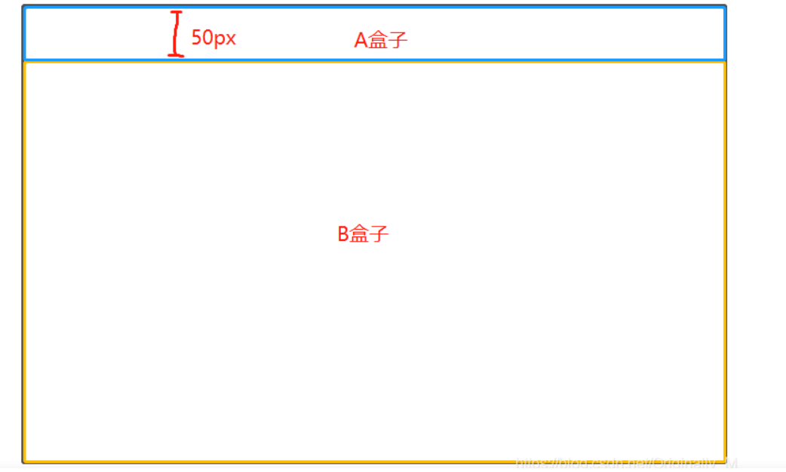

# 元素垂直居中的方式

- 设置父元素 `display: flex;align-items: center;`
- 设置父元素设置`display:flex;`子元素设置`align-self: center;`


# css杂烩

## 关于height: calc(100% - 50px);

- 真实在项目中的应用场景



A、B两个盒子拥有一个共同的父元素，现在我们设置了A元素的高度为50px，我们希望B元素占据剩余的高度，于是我们就可以使用`calc`函数进行设置
```css
B盒子 {
    height: calc(100% - 50px);
}
```
